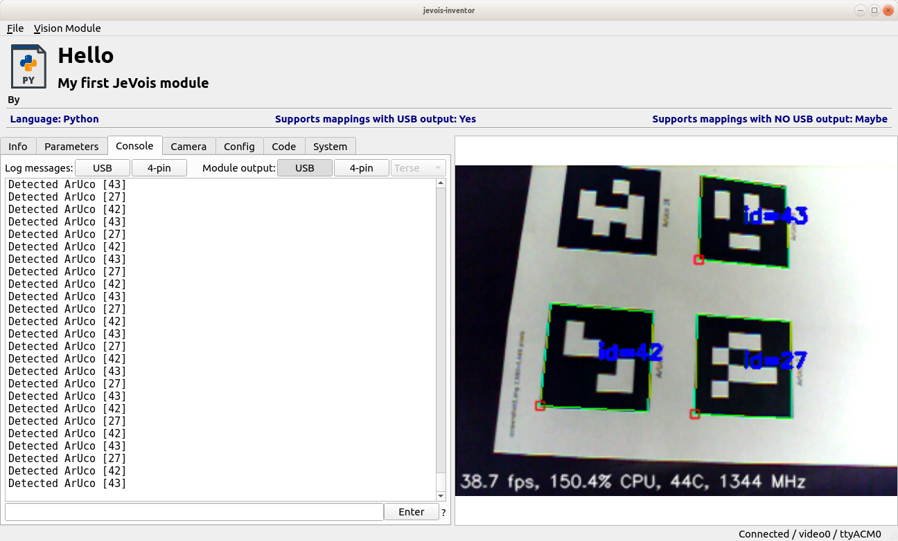
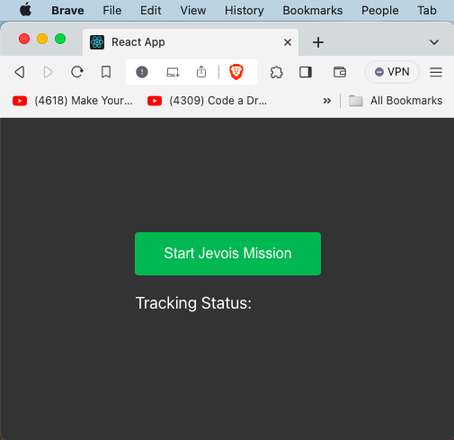
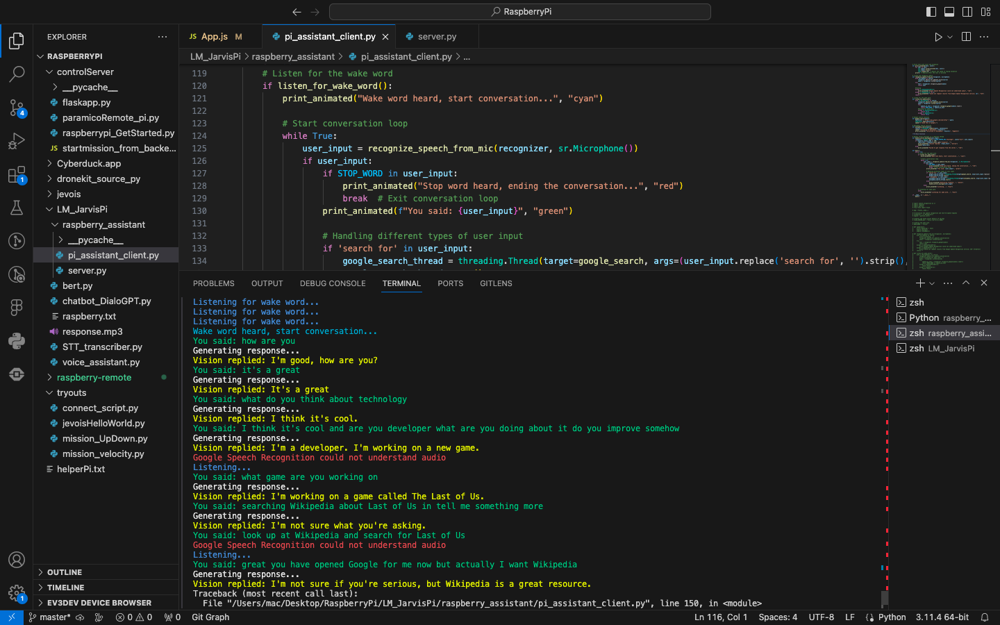
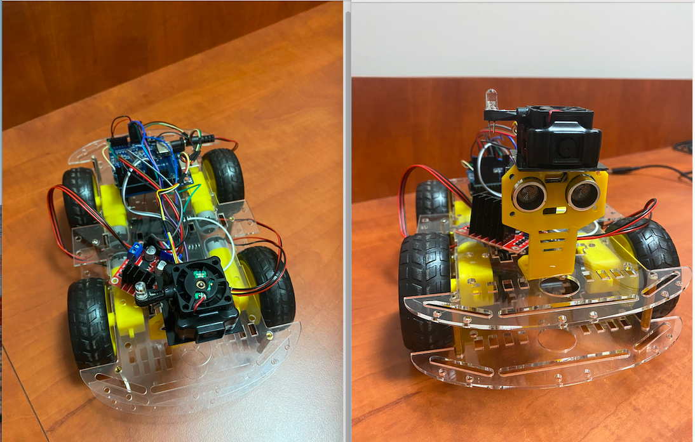

# RaspberryPi_Jevois
Jevois Smart Cam integrated with Raspberry Pi for Tracking and Auto-Missions

# Look at JevoisPi_nextGen.ipynb for more detailed documentation with example

- Jevois Camera SetUp

- Raspberry Pi SSH and Server Deployment

- Voice Assistant over Raspberry Pi Server

  
